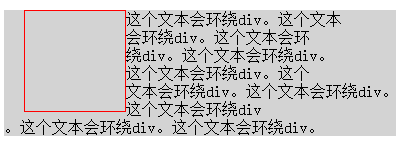
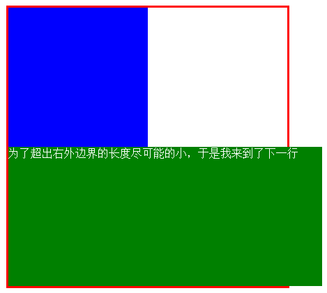
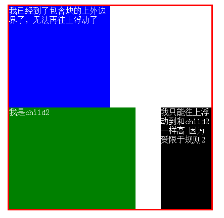
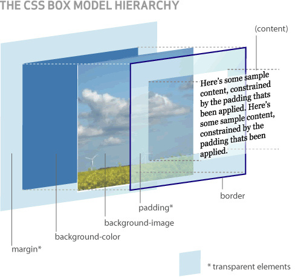
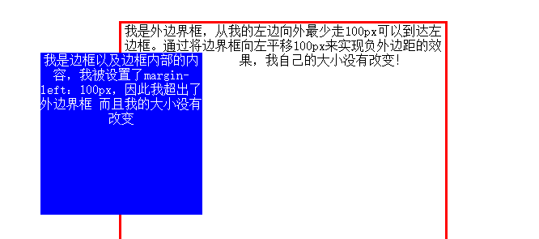
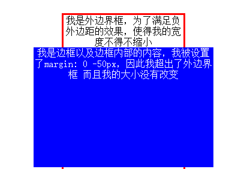
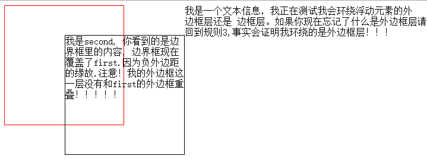
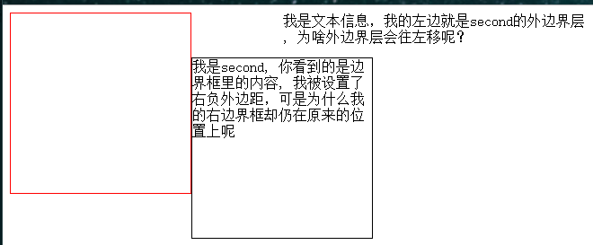
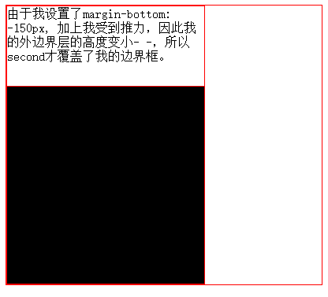

# CSS后花园之浮动的秘密
***
### 想说的话
这应该算得上是博主的第一篇博文吧，这段时间博主在系统的学习CSS，这个过程中遇到了不少的坑(真的是太坑了。。),想分享一些东西给大家，同时也想提升一下自己写博文的水平(毕竟是第一篇博文).如果你是想好好把CSS浮动的内容弄清楚,那么博主强烈建议你看完并且透彻的理解接下来的内容;如果你只是好奇,那博主强烈建议你收藏本文。
### float
| 值 | left,right,none,inherit     |
| :------------- | :------------- |
| 初始值       | none       |
| 应用于       | 所有元素       |
| 继承性       | 无       |
| 计算值       | 根据指定确定       |
`
Tip: 表中的属性还是要注意， 值的取值范围要记住的- -，高中数学不是说定义域是函数的生命吗，这里“值”的取值范围其实也是这个CSS元素的生命。什么继承性的，还是记一下吧，别偷懒！
`
### 浮动对于文档流的影响
* 浮动会使得浮动的元素脱离文档流
* 其他内容会环绕该元素(例如文本)

`脱离文档流的浅一点的含义就是, 他不再按照默认的排版来摆放元素了, 而是有自己新的摆放方式, 具体是怎样摆放的, 接下来告诉你。第二条影响说明了不仅仅只有文本会环绕浮动的元素`

看一下代码示例:
```css
div{
  float: left;
  width: 100px;
  height: 100px;
  border: solid 1px red;
  margin-left: 20px;
}

p{
  background: lightgray;
}
```
```html
<div></div>
<p>这个文本会环绕div。这个文本<br>
  会环绕div。这个文本会环<br>
  绕div。这个文本会环绕div。<br>
  这个文本会环绕div。这个<br>
  文本会环绕div。这个文本会环绕div。<br>
  这个文本会环绕div<br>
  。这个文本会环绕div。这个文本会环绕div。
</p>
```
效果如下:



### 图1

可以看到, div位于p上方,说明div脱离了文档流(这个理由虽然不充分,但是这里这样描述已经足够了), 文本确实也环绕了div。(文本环绕div的原因肯定和文本的内容无关~~)

### 问题的关键-如何摆放浮动元素
我们先假设一个浮动的元素可以摆放在文档中的任何位置(虽然假设看上去很奇怪, 但是后面你会明白为什么我要这样假设),我们通过设置一系列的规则,最终让整个文档中能够摆放浮动的元素的位置是唯一的。(所以这些规则你必须装在你的大脑里并且深刻的理解)。在我们正式开始讲解这个问题之前, 要先科普一下什么是包含块(containing block)，这可是继续往下讲的基础。

> **浮动元素** 的包含块是最近的 **块级** 祖先元素

`用加粗字体来显示表示这个内容很重要, 真的很重要! 给浮动元素加粗表示其他种类的元素的包含块可能不是这样的，比如说绝对定位元素的包含块。图1的body就是div的包含块，body也是块级元素！`

元素在声明浮动的时候(声明的值肯定不是none),会自动来一句display: block.比如说你给span元素声明浮动的时候,它就会变成和div一样的块级元素显示.现在给用户代理(比如游览器)一个浮动元素,它会遵守以下的每一条规则从而找到浮动元素应该摆放的唯一位置

* #### 规则1:  左浮动元素的右外边距边界(以下简称外边界)超出包含块的右内容边界(以下简称右内边界)的长度应该尽可能的少,左浮动元素左外边界不能超出包含块的左内边界; 反之。

这条规则告诉我们浮动元素排版的时候，不能所有浮动元素排成一条横线,还为浮动元素设置了能够摆放的位置的垂直边界.还隐含着CSS允许浮动元素的外边界超出包含块的外边界。
```css
div.container{
  float: left;
  width: 400px;
  border: solid 3px red;
  margin: 10px 0 0 10px;
}

div.child1 {
  float: left;
  width: 200px;
  height: 200px;
  background: blue;
}

div.child2 {
  float: left;
  width: 450px;
  height: 200px;
  background: green;
  color: white;
}
```
```html
<div class="container">
    <div class="child1">
    </div>
    <div class="child2">
      为了超出右外边界的长度尽可能的小，于是我来到了下一行
    </div>
</div>
```


图2

可以看到div.child2为了尽可能的超出右外边界少一点，选择了换行。 **尽可能** 这个说法值得好好掂量掂量.

* #### 规则2: 浮动元素的上外边界不能高于之前所有的浮动元素或块级元素的上外边界, 浮动元素浮动的天花板是包含块的上内边界。

这条规则实际上给出了浮动元素的上边界。
```css
div.container{
  float: left;
  width: 400px;
  border: solid 3px red;
  margin: 10px 0 0 10px;
  color:white;
}

div.child1 {
  float: left;
  width: 200px;
  height: 200px;
  background: blue;
}

div.child2 {
  float: left;
  width: 250px;
  height: 200px;
  background: green;
  color: white;
}

div.child3 {
  float: right;
  width: 100px;
  height: 200px;
  background: black;
  color: white;
}
```

```html
<div class="container">
    <div class="child1">
    我已经到了包含块的上外边界了，无法再往上浮动了
    </div>
    <div class="child2">
      我是child2
    </div>
    <div class="child3">
      我只能往上浮动到和child2一样高 因为受限于规则2
    </div>
</div>
```


图3

可以看到child1的上外边界和包含块的上内边界是一样高的，child3的上外边界高度和child2是一样高的
* #### 规则3:拥有相同包含块的浮动元素的外边界不能重叠

看上去这似乎使得浮动元素之间相互重叠变得不可能，但是请注意！这里指的是外边界不能重叠，也就是说 是浮动元素的外边距这一层不能重叠，意味着内容层是可以重叠的，这将为接下来介绍浮动元素的负外边距打下基础。可能你会对外边距这一层不能重叠这种描述看到困惑。看一下接下来的图你就知道了。


图4

其实以往我们看待CSS盒子模型是站在平面的角度来思考的，其实CSS(层叠样式表)中层叠的含义之一就在于这里，一个元素的显示，是按层来渲染的，先是外边距层，然后是background-color和background-image层，然后是padding+border层，最后才是内容(content)层。
* #### 规则4: 假设浮动元素之前有一个元素A, 则浮动元素不能高于元素A内的所有行框的上边界

这条规则一开始理解起来可能会感到困惑，其实博主一开始理解的时候也是遇到了很多障碍，后来分析，其实就是对 文本的格式化 没有弄清楚， 行框和行内框的概念不是很清晰。如果读者希望弄明白这条规则，建议先去阅读相关知识，再来理解这条规则会变得更加容易。
* #### 规则5: 浮动元素应该尽可能的高

浮动元素尽可能往上冒，这条几乎快成为常识的规则还是必须列出来，而且这条规则在执行的时候不能违反前面的任何规则。
* #### 规则6: 左(右)浮动元素应该尽可能靠左(右)

同样的，这条规则在执行的时候不能够违反前面的任何规则。

### 浮动的秘密---负外边距
先科普一下: 在外边距  边界宽度   内边距   宽度  高度 的取值中  只有外边距允许出现负值。注意:是只有外边距！！！
#### 什么是外边距?
首先，外边距这一层(详情见图4)是透明的,CSS也没有提供任何方法来让它变得不透明。它用于设置元素的边框及边框内部的内容与外边界框的位置关系
#### 块级元素的外边距
由于任何元素在浮动的时候，其盒子都会变成块级盒子(display:block),因此讨论块级元素的外边距和浮动元素的外边距其实是一样的.当你设置margin-left: 100px;的时候，可以理解成，这个时候从盒子的左外边界出发，向盒子内部走，如果你要碰到左边界框，那你最少要走100px。当你设置margin-left:-100px;可以理解成，从盒子的左外边界出发，向盒子的外边界走，如果你碰到左边界框，最少要走100px。外边距的取值正负仅仅是走的方向问题。
#### 块级元素外边距的影响
* 对块级元素设置外边距  不会影响到边界框的大小
* 不会导致外边框的大小改变，除非 **万不得已** 的情况
* 边界框和外边界框之间的位置关系

看一张图会明白很多很多的。


图5

> 图5里的内容表述有误。margin-left: 100px; 改成margin-left: -100px;



图6

这只是一个演示图，实际中外边距层是不可能会有颜色的，上面提到的万不得已的情况其实就是 为了满足外边距要达到的效果致使外边界框不得不做出变大或变小,比如说margin: 100px; 此时为了满足外边距的效果，使得外边距层在垂直和水平方向都增加了200px。所以说设置外边距导致外边框的变化其实是一种无奈之举。

说了那么多, 是时候看看负外边距在浮动元素下的行为了.上图上代码！
```css
div {
  float: left;
  width: 200px;
  height: 200px;
  border: solid 1px red;
}
div.second {
  margin: 50px 0 0 -100px;
  border-color: black;
}
```
```html
<div class="first">

</div>
<div class="second">
  我是second, 你看到的是边界框里的内容, 边界框现在覆盖了first.因为负外边距的缘故.注意！我的外边框这一层没有和first的外边框重叠！！！！！
</div>
我是一个文本信息，我正在测试我会环绕浮动元素的外<br>
边框层还是 边框层。如果你现在忘记了什么是外边框层请<br>
回到规则3,事实会证明我环绕的是外边框层！！！<br>
```

图7

可以看到, 文本环绕的是外边框层, 并非是内容层, 这一点要切记！!!!为什么要这样设定, 其实也很好理解，假设文本环绕的是边框层, 那浮动元素设置的正外边距肯定是无效的，正因为这样，所以有这样的设定~~~

另外一个有意思的问题来了，假设我现在给图7中的second取消掉原来的margin-left:-100px,改为margin-right:-100px;效果会是怎样的呢?
```css
div
  float: left;
  width: 200px;
  height: 200px;
  border: solid 1px red;
}
div.second {
  margin: 50px -100px 0 0;
  border-color: black;
}
```


图8

奇怪的事情发生了，为什么second的边界框没有向右移动，反而停留在原来的位置。可以肯定的是，由于外边界框受限于之前的六大定位规则，其位置肯定是不会改变的。所以图8告诉我们，外边界框的宽度变小了！现在，必须告诉你float:left;意味着什么(除了之前介绍的六大定位规则),

`在左浮动元素中,游览器会施于其右边界框向左的推力；反之。`

这个描述看起来很奇怪，来，容我给你一番介绍。
当你设置负右外边距的时候，一般的块级元素会通过将边界框向右平移来达到效果,但是在这个向左的推力的作用下, 是不会平移的，转而通过改变元素外边界框的大小的方式来达到负右外边距的效果。这实际上就是将我们上面介绍的外边距影响的第二条"万不得已"这个条件变得更加容易发生了。但是请注意，向左的推力仅仅会作用在右外边距上。
向左向右浮动的元素都会受到由下向上的推力,很明显哈，这个推力仅仅作用域负下外边距。还有就是不存在从上往下的推力。直接上代码:
```CSS
.wrapper {
  width: 400px;
  border: solid 1px red;
  overflow: hidden;
}

.first, .second {
  float: left;
  width: 250px;
  height: 250px;
  border: solid 1px red;
}

.first {
  margin-bottom: -150px;
}

.second {
  background: black;
}
```

```html
<div class="wrapper">
  <div class="first">
    由于我设置了margin-bottom: -150px, 加上我受到推力，因此我的外边界层的高度变小- -，所以second才覆盖了我的边界框。
  </div>
  <div class="second">

  </div>
</div>
```



图9

`注意，由于游览器在绘制元素的时候，后面的元素其实是比前面的元素更靠近用户，这个例子就可以说明`
好了，针对负外边距的内容就这么多，CSS的浮动还剩下最后一个秘密，清除浮动！

3. ### 浮动的最后一个秘密:清除浮动

#### 先介绍clear元素

| 值 | left,right,both,none,inherit     |
| :------------- | :------------- |
| 初始值       | none       |
| 应用于       | 块级元素       |
| 继承性       | 无       |
| 计算值       | 根据指定确定       |

`注意，这里的应用范围是块级元素！记得先看一下取值范围`

先解释一下clear:left;的意义, 当你为元素A设定这条样式规则的时候，就好像在告诉游览器:禁止元素A的左边有浮动元素。虽然这种表述非常的不严谨，但是博主觉得这样去理解清除浮动是最好的方式！
看一下清除浮动的效果:

```css
div {
  float: left;
  width: 200px;
  height: 200px;
  border: solid 1px red;
}

.second {
  clear: left;
}
```

```html
<div class="first">
本来我的右边应该有second的，但是由于它不准它的左边有我，但是我必须遵守我的摆放的六大规则，所以second只好放到我下面去了。
</div>
<div class="second">
我通过设置clear:left来禁止我的左边出现浮动元素(比如说first), 这相当于在原来摆放的六大规则上新增了一条规则，变成了非常6+1，因此我只能跑到first下面去。
</div>
```

图10

可以看到, 使用clear的元素其实相当于给自己新增了一条摆放规则，但是不会影响到之前的元素。
设置clear:both 相当于同时设置clear:left和clear:right

##### 好了 关于浮动的内容就介绍到这里了, CSS其实是一个很深的坑。本文是博主第一次写博文，如果你有什么建议或者错误，欢迎在评论里指出，让我更有动力写出更好的文章！
这是我的个人主页 [Mr-code](www.mrcodex.com)

这是我的[github](www.github.com/niugeshenhua)
